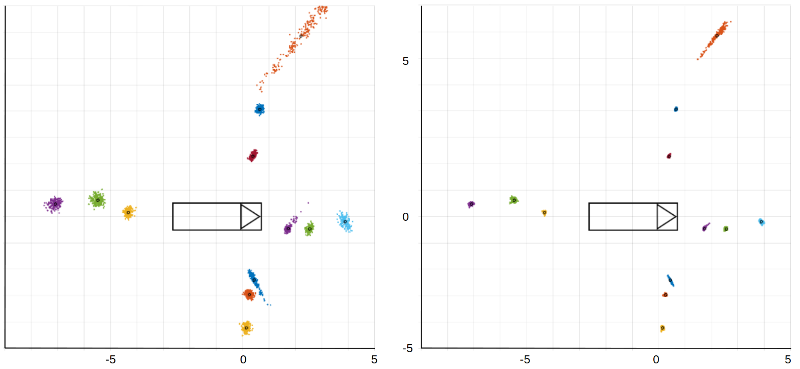
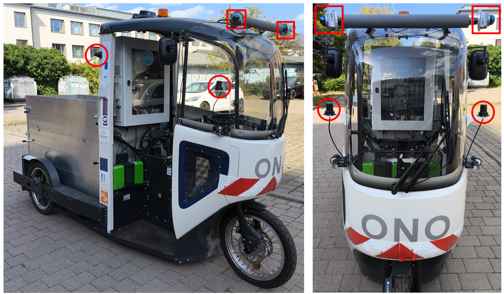
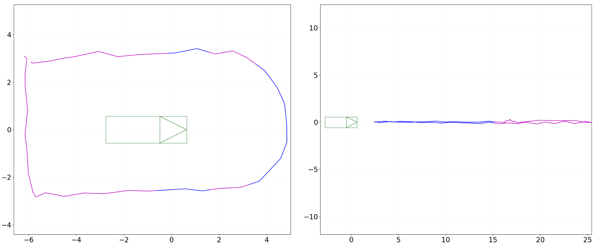
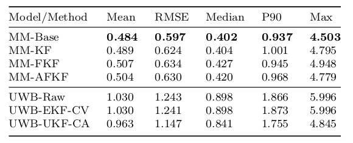
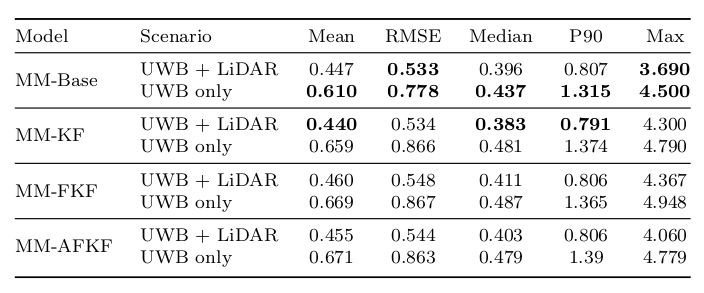
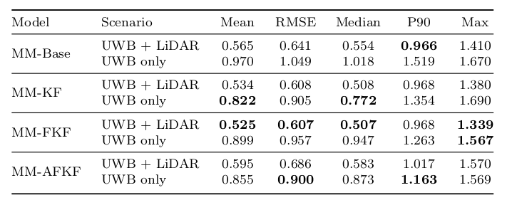
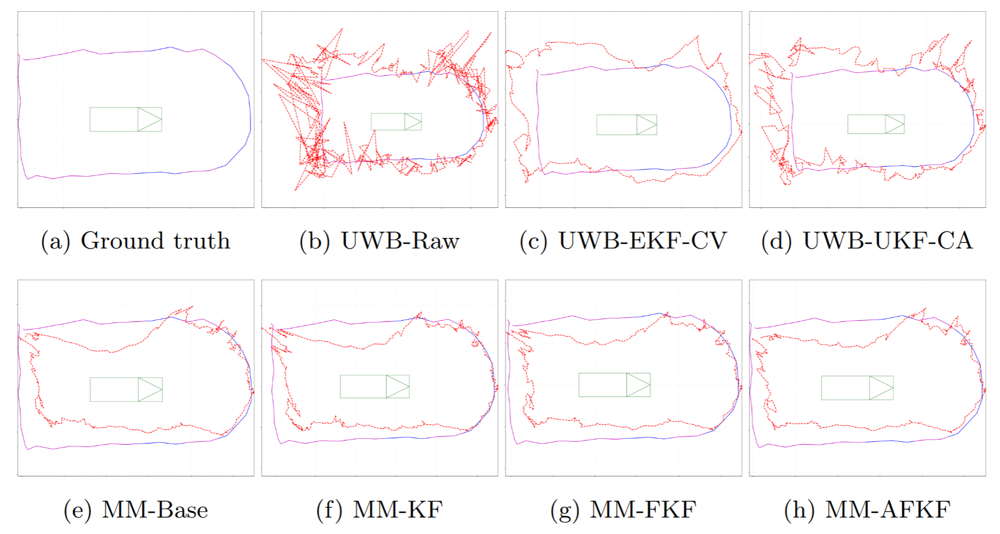
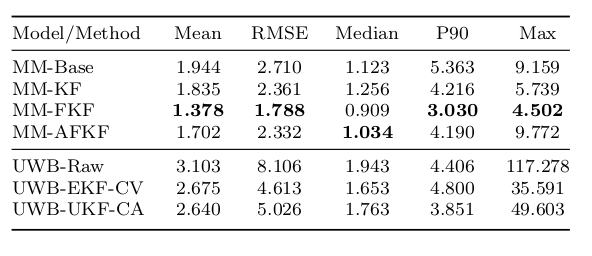
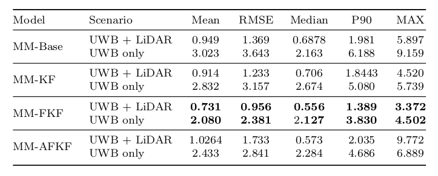

# Sensor Fusion 

Relative position estimation based on multimodal sensor fusion of Ultra-Wideband (UWB) and LiDAR data

> 📧 **Note**: Only sample data is included here. Full dataset is available here:  
> [Download full dataset](https://cloud.ovgu.de/s/i32f79eCJCHp9Kn)  
> or use helper scripts: download_dataset.sh (shell) download_dataset.py (python)

> Academic or research purposes, please contact:  
> [stefan.sass@ovgu.de](mailto:stefan.sass@ovgu.de)  
> [markus.hoefer@ovgu.de](mailto:markus.hoefer@ovgu.de)

## download dataset

- dependencies:

``` bash
sudo apt install wget unzip rsync
```

- shell script

``` bash
chmod +x download_dataset.sh
./download_dataset.sh
```

- python script:

``` python
python download_dataset.py
```


## 🗂️ Folder Structure

```
├── config
│   ├── rviz.rviz             # config for rviz2 (ros2) 
├── dataset
│   ├── test                  # test data -> dedicated test trajectories (circular/linear)
│   └── train_val_test        # dataset for training (can be split in train/test/val via data generator)
├── utils
│   ├── hdf5_rviz2_player.py   # plays hdf5 files like rosbags to visualize in rviz2 (ros2) 
│   └── interactive_marker.py  # used for annotating the ground truth in raw rosbags
│   └── model_node.py          # node for use trained model in ros2
├── data_generator.py          # dataset creator
├── model.py                   # tensorflow models
├── test.py                    # script for test trained models
├── train.py                   # script for train model
├── train_all.py               # script for train all models sequencially     
```


## 🧠 Tasks

Accurate relative localization of a target person for Follow-Me robots using multimodal sensor fusion, 
combining continuous UWB ranging with spatially precise LiDAR point clouds.

Why Fusion? While UWB provides continuous distance measurements, 
a raw UWB signal alone is often too noisy and prone to signal reflections or multi-path effects. 

By fusing it with LiDAR, we leverage the high spatial precision of point clouds to filter noise 
and achieve the robust tracking required for reliable Follow-Me behavior.


<\br>

*UWB positioning data in relative vehicle coordinates: Measurements are shown
at distances of 1 m, 2 m, and 3 m to the right, left, front, and rear of the vehicle
outline. Unfiltered raw signals (left), signals filtered with an Extended Kalman Filter
(right). Units in meters.*


## 📸 Sensor Setup

The dataset was recorded from a mobile sensor platform mounted on a cargo bike, 
capturing Lidar and uwb data.



## Dataset

- annotated dataset (train/test/val) with 46,024 samples (uwb, uwb_filterd (EKF), lidar, ground truth)
- dedicated dataset (circular/linear trajectory)



*Dedicated test set comprising two trajectories: circular (left) and radial (right).
Colors indicate the available sensor modalities: blue (fusion of UWB and LiDAR) and
magenta (UWB only). Units in meters.*


## 🔬 Baseline Models

Baseline models:
- Minimal Multimodal Model (MM-Base)
- Kalman Multimodal Model (MM-KF)
- Fused Kalman Multimodal Model (MM-FKF)
- Adaptive Fused Kalman Multimodal Model (MM-AFKF)


are provided using TensorFlow. Each task comes with:

- Custom dataloaders
- Model architecture
- Training and testing scripts
- Pretrained models 

You can find them under:

- saved_models/best_models/

## Results
Dataset

<br>
<br>


Circular Trajectory

<br>
<br>
<br>

Linear Trajectory

<br> 
<br>
<br>


## Acknowledgments
The project Aura Hirn 2 is funded by the federal state Saxony-Anhalt and the European Regional Development Funds 
(EFRE, 2024-2026), project number ZS/2023/11/181954.


## 🔗 Citation

